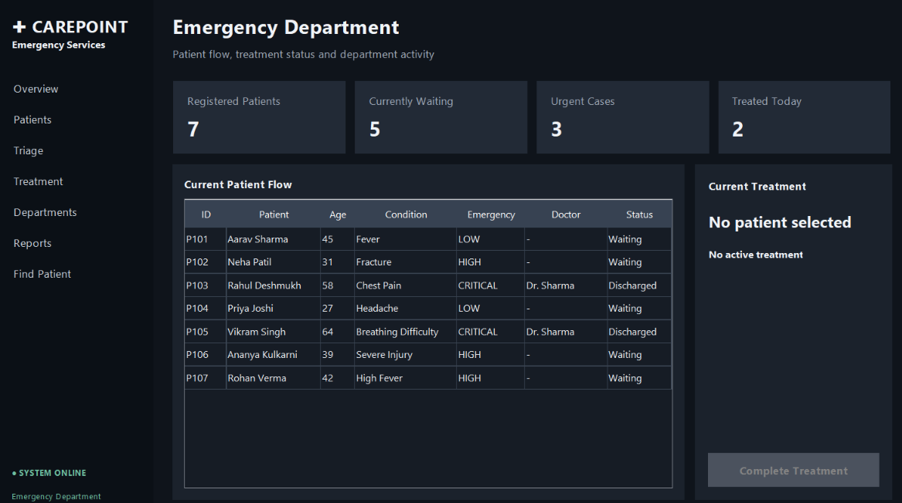
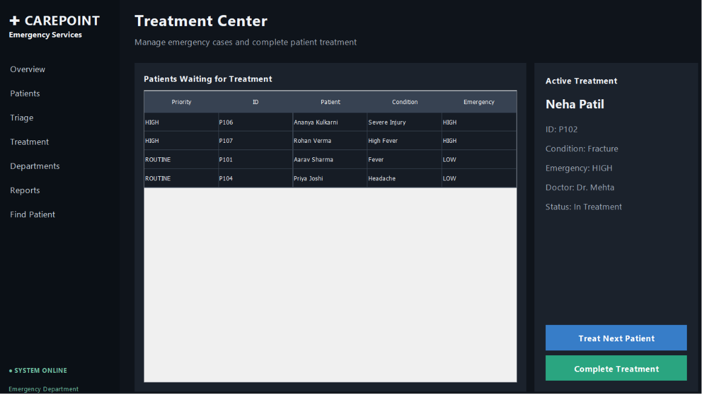
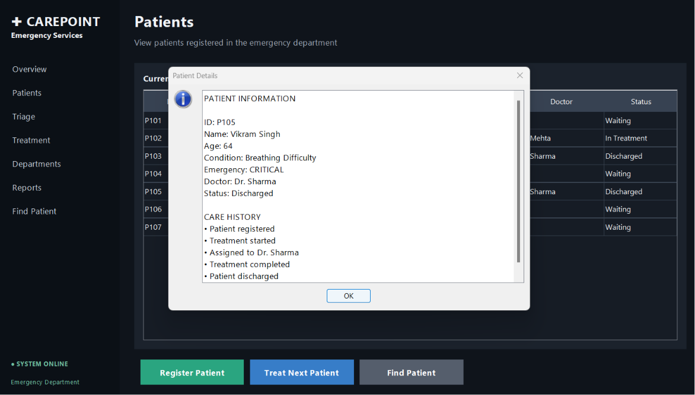
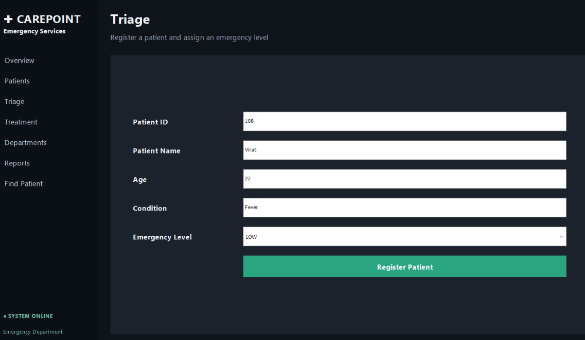

# 🏥 CarePoint – Hospital Emergency Flow Simulator

A Java Swing desktop application that simulates the workflow of a hospital emergency department.

The system manages patient registration, emergency triage, priority-based treatment, doctor assignment, patient search, and hospital department routing.

## 🚑 Features

- Patient Registration
- Emergency Triage
- Priority-based Treatment
- Doctor Assignment
- Treatment Completion & Discharge
- Patient Search
- Hospital Department Routing
- Dashboard Statistics
- Reports

## 🧠 Data Structures Used

- Priority Queue / Heap – Emergency patient prioritization
- Queue – Waiting patients
- Hash Table – Fast patient search
- Stack – Activity/history tracking
- Graph – Hospital department routes
- Searching & Sorting – Patient organization and lookup

## 🔄 Patient Workflow

Registration → Triage → Priority Assignment → Waiting Queue → Treatment → Discharge

Critical patients are treated before lower-priority cases.

## 🛠 Technologies

- Java
- Java Swing
- Object-Oriented Programming
- Data Structures & Algorithms

## 📸 Screenshots

### Dashboard

### Treatment Center

### Patient Search

### Triage & Registration

## ▶️ How to Run

Compile:

    javac HospitalEmergencySimulator.java

Run:

    java HospitalEmergencySimulator

Or launch the provided JAR / Windows application.

## 🎯 Purpose

This project demonstrates how Data Structures and Algorithms can be applied to a realistic hospital emergency workflow.

## 📌 Project Highlights

- Real-world emergency workflow simulation
- Priority-based patient handling
- Custom data structures
- Interactive Java Swing GUI
- Search, routing, and treatment management

## 👨‍💻 Author

**Sujal Patil**
